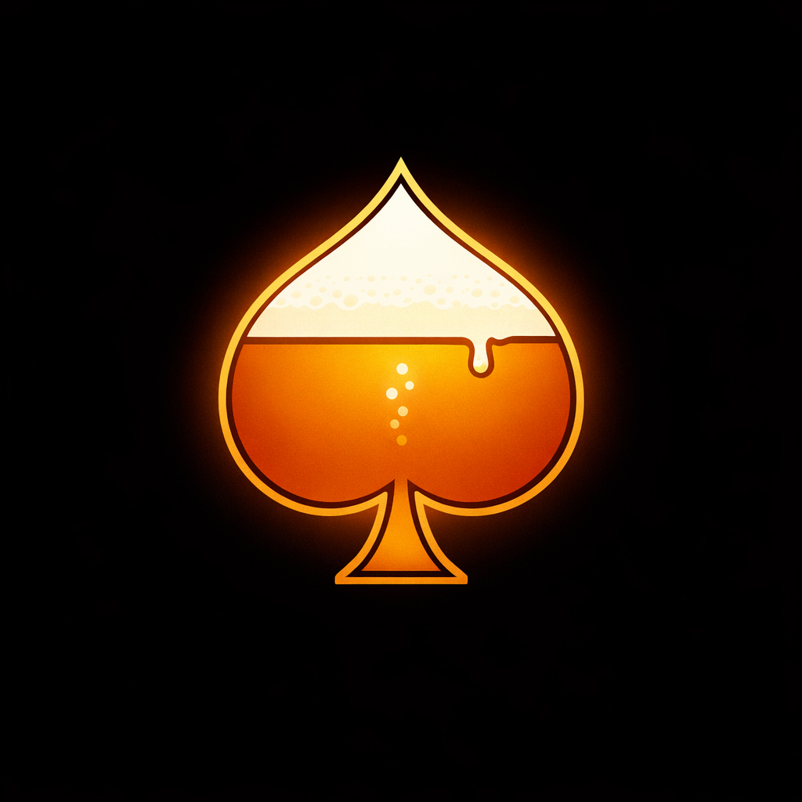

# BlackJack Game 🃏
_an AdHoc creation_

Welcome to _**Black(Out)Jack**_, a multiplayer browser-based blackjack card game with a drinking party game twist. Play it online with friends instantly, no account or installs required.

<p align="center">
  
</p>

<p align="center">
  <a href="https://black-out-jack.onrender.com">
    
  </a>
</p>


## What is Black(Out)Jack?

- **BlackJack with custom drinking rules:** sip wager, suited and double multiplier, milestone handouts, and more
- **Multiplayer on your phone or web:** play with friends, local or remote, or by yourself against NPC players
- **Three ways to play:** fully digital, real cards with referee, or terminal based
- **Strategy tracking:** see how you compare to optimal basic strategy
- **Always split 10s:** drinking incentives that reward bold strategy

---
## Quick Start

```bash
# Requires Python 3.10+
git clone https://github.com/robert-rjm/Black-Out-Jack.git
cd Black-Out-Jack
pip install flask
python server.py                 # → http://localhost:5000
```
> [!TIP]
> Add to your home screen for a native app feel — see [Multiplayer.md](docs/Multiplayer.md#pwa-support) for instructions.


## Game Modes

| Mode | Command | Description |
|------|---------|-------------|
| Web UI | `python server.py`| Browser-based multiplayer (or [play online](https://black-out-jack.onrender.com)) |
| Terminal Game | `python blackjack.py` | Fully playable locally in terminal |
| Terminal Referee | `python referee.py` | Physical deck, digital scorecard |


## Drink Responsibly
> [!IMPORTANT]
> This game is best enjoyed in good company and with good judgment.
> **Drink responsibly and know your limits**.
>
> _The goal is to have fun, not regrets._ 🍻


## Documentation

| Doc | Description |
|------|-------------|
| [Rules.md](docs/Rules.md) | Extensive Drinking Rules |
| [Cheat-Sheet.md](docs/Cheat-Sheet.md) | One-page gameplay rules reference|
| [Multiplayer.md](docs/Multiplayer.md) | Room setup, rules, KPI panel, milestones |
| [Comprehensive-Example.md](docs/Comprehensive-Example.md) | Full round walkthrough|
| [Architecture.md](docs/Architecture.md) | Project structure, file dependencies, simulation |

> [!TIP]
> These rules are not set in stone, the best rules often come mid-game!
>
> Players are encouraged to come up with new rule ideas as they play. If they make the game more fun, they are probably worth keeping!


## Contributing

Rule ideas are especially welcome — if it made the game more fun, it probably belongs here! Please:

> **Fork** → **Branch** → **Commit** → **Push** → **PR**


## License

[](https://creativecommons.org/licenses/by-nc-sa/4.0/)

This project is licensed under CC BY-NC-SA 4.0. See [LICENSE](LICENSE) for details.

## Credits

- **Game concept & rules:** R. Michels, D. Irrgang, M. Cvijic
- **Development:** R. Michels

---

*Happy Gaming! 🎰 May the cards be in your favor!*
